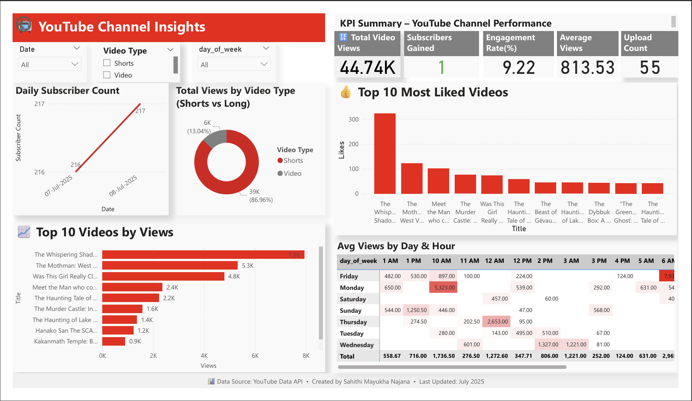

# 📊 YouTube Channel Analytics – End-to-End Project

This project is a complete data analytics pipeline that collects, stores, analyzes, and visualizes performance metrics for a YouTube channel.

---

## 🔧 What This Project Includes:

✅ **Python (ETL Script)**  
- Connects to the YouTube Data API  
- Pulls video metadata, stats, and subscriber count  
- Classifies Shorts vs Videos  
- Calculates engagement rate  
- Tracks daily subscriber gain  
- Saves cleaned data to CSV and pushes it to Azure SQL

✅ **Azure SQL Database**  
- Structured star schema with tables:
  - `youtube_videos`, `daily_subscribers`, `video_category`, `upload_schedule`, `video_annotations`
- Supports Power BI with clean relationships

✅ **Power BI Dashboard**  
- Dynamic KPI cards (views, subs, engagement)  
- Time-series charts (subscriber growth)  
- Heatmap of best posting times  
- Shorts vs Videos comparison   
- Interactive slicers and filters

---

## 🧱 Tech Stack

- **Python** – Data extraction, transformation, and loading
- **YouTube Data API v3** – Data source
- **Azure SQL** – Cloud database warehouse
- **Power BI** – Business intelligence visualization

---

## 📷 Power BI Dashboard Preview

> Preview of the main insights page from the Power BI report.

This Power BI dashboard provides real-time analytics on a YouTube channel's performance, including KPIs, engagement, video type analysis, and heatmap of best posting times.

🔗 Download the Power BI file: [YouTube_Channel_Insights.pbix](YouTube_Channel_Insights.pbix)

---

## 📌 Key Metrics Tracked

- Total Views, Likes, Comments
- Engagement Rate (%)
- Daily Subscriber Gain
- Top Performing Videos
- Best Day & Time to Upload

---

## 👤 Author

**Sahithi Mayukha Najana**  
📅 July 2025

---

## 🚀 Future Enhancements

- Automate daily data refresh with scheduler
- Add email reporting using Power Automate
- Build a public portfolio with live Power BI report

